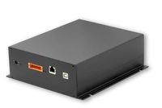

.. currentmodule:: metratec_rfid

Hf Reader
=========

QuasarLR HF RFID Reader
-----------------------

  
The QuasarLR is an HF long range RFID reader/writer for demanding industrial applications, where high reading reliability, high read 
ranges and extensive special tag features are needed. Highlights include an RF power of up to 4 W which allows a read 
range of up to 60cm with the right antenna (e.g. our Lambda-40 Loop Antenna). This allows even difficult applications directly at 
conveyor belts, in production machinery and in laundry applications.

.. autoclass:: metratec_rfid.QuasarLR
    :members:
    :inherited-members:
    :special-members: __init__

QuasarMX HF RFID Reader
-----------------------

.. image:: ./../_static/quasarmx.jpg
   :alt: QuasarMX
   :align: right

The QuasarMX is an HF RFID reader/writer for demanding industrial applications, where high reading reliability, speed and extensive 
special tag features are needed. Highlights include a reading rate of up to 100 tag-IDs/sec and reading and writing data on tags 
without needing to address them individually. This allows applications directly at conveyor belts, in production machinery and in 
electric control cabinets. 

.. autoclass:: metratec_rfid.QuasarMX
    :members:
    :inherited-members:
    :special-members: __init__

DeskID ISO Desktop Reader
-------------------------

.. image:: ./../_static/deskid-hf.jpg
   :alt: DeskId ISO
   :align: right

The DeskID ISO is an especially compact HF RFID reader / writer for use in office and home environments. Typical applications 
include customer management (e.g. in sports studios), the configuration of access control systems and all other applications in which 
RFID tags are to be read with a PC or notebook computer.
The low profile design housing is meant for desktop use and allows every computer user to read and write RFID tags according to ISO 
15693 (as long as they have not previously been locked). The read range varies between 5 and 10 cm depending on tag type. Reading 
of multiple tags (anti collision feature) is also supported.

.. toctree::
   :maxdepth: 3

.. autoclass:: metratec_rfid.DeskIdIso
    :members:
    :inherited-members:
    :special-members: __init__
    :exclude-members: get_input, get_inputs, get_output, get_outputs, get_antenna, set_antenna, get_antenna_multiplex, set_antenna_multiplex, set_antenna_outputs, set_cb_input_changed, enable_antenna_report