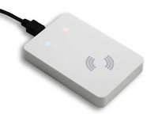

.. currentmodule:: metratec_rfid

.. _deskidiso:

DeskID ISO Desktop Reader
=========================

The DeskID ISO is an especially compact HF RFID reader / writer for use in office and home environments. Typical applications 
include customer management (e.g. in sports studios), the configuration of access control systems and all other applications in which 
RFID tags are to be read with a PC or notebook computer.
The low profile design housing is meant for desktop use and allows every computer user to read and write RFID tags according to ISO 
15693 (as long as they have not previously been locked). The read range varies between 5 and 10 cm depending on tag type. Reading 
of multiple tags (anti collision feature) is also supported.

.. toctree::
   :maxdepth: 3

.. autoclass:: metratec_rfid.DeskIdIso
    :members:
    :inherited-members:
    :special-members: __init__
    :exclude-members: get_input, get_inputs, get_output, get_outputs,
      get_antenna, set_antenna, get_antenna_multiplex, set_antenna_multiplex,
      set_antenna_outputs, set_cb_input_changed, enable_antenna_report,
      get_inventory_multi, start_inventory_multi, stop_inventory_multi
