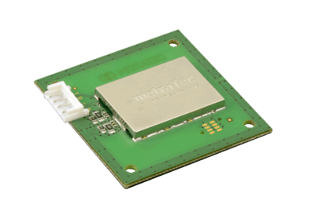

.. currentmodule:: metratec_rfid

.. _qrnfc:

QR-NFC Embedded OEM Module
--------------------------

The compact OEM module with an integrated 13.56 MHz antenna can read and
write all NFC RFID transponders over a range of a few cm. This includes
ISO15693 tags (NFC Type 5) and all ISO14443-A based transponders including
all products from the NXP Mifare® series. This includes not only Mifare
Classic and Ultralight® but also NTAG transponders as well as the very
secure Mifare DESFire® tags.

.. autoclass:: metratec_rfid.QrNfc
    :members:
    :inherited-members:
    :special-members: __init__
    :exclude-members: check_antennas, enable_input_events, get_antenna, get_antenna_multiplex, get_input, get_inputs, get_inventory_multi, get_output, get_outputs, set_antenna, set_antenna_multiplex, set_cb_input_changed, set_output, set_outputs, start_inventory_multi, stop_inventory_multi