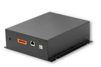

.. currentmodule:: metratec_rfid

.. _quasarlr:

QuasarLR HF RFID Reader
=======================

  
The QuasarLR is an HF long range RFID reader/writer for demanding industrial applications, where high reading reliability, high read 
ranges and extensive special tag features are needed. Highlights include an RF power of up to 4 W which allows a read 
range of up to 60cm with the right antenna (e.g. our Lambda-40 Loop Antenna). This allows even difficult applications directly at 
conveyor belts, in production machinery and in laundry applications.

.. autoclass:: metratec_rfid.QuasarLR
    :members:
    :inherited-members:
    :special-members: __init__
