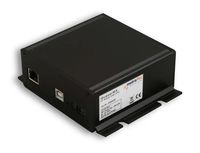

.. currentmodule:: metratec_rfid

.. _quasarmx:

QuasarMX HF RFID Reader
=======================

The QuasarMX is an HF RFID reader/writer for demanding industrial applications, where high reading reliability, speed and extensive 
special tag features are needed. Highlights include a reading rate of up to 100 tag-IDs/sec and reading and writing data on tags 
without needing to address them individually. This allows applications directly at conveyor belts, in production machinery and in 
electric control cabinets. 

.. autoclass:: metratec_rfid.QuasarMX
    :members:
    :inherited-members:
    :special-members: __init__