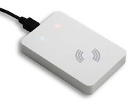

.. currentmodule:: metratec_rfid

Uhf Reader
==========

PulsarLR UHF RFID Reader
------------------------

.. image:: ./../_static/pulsarlr.png
   :scale: 25%
   :alt: PulsarLR
   :align: right
  
The right tool for the hardest UHF RFID applications. This reader can reach a reading distance of up to 12m with a modern UHF RFID
transponder and easily scan a few hundred tags per second.
The four antenna ports give you the flexibility to build complex RFID devices, such as RFID gates and tunnels.

.. autoclass:: metratec_rfid.PulsarLR
    :members:
    :inherited-members:
    :special-members: __init__

PulsarMX UHF RFID Reader
------------------------

.. image:: ./../_static/pulsarmx.jpg
   :alt: PulsarMX
   :align: right

The PulsarMX is a UHF RFID Reader for applications with medium read range between 2 and 5 m and up to 100 tags at the same 
time in the field (anti collision). Typical applications include container tracking, reading data from sensor tags or as a scanning station 
on a conveyor belt. With its low cost, it open up new possibilities for RFID which were not economical before.

.. autoclass:: metratec_rfid.PulsarMX
    :members:
    :inherited-members:
    :special-members: __init__

DeskID UHF Desktop Reader
-------------------------

The DeskID UHF is a small and economical RFID reader and writer for the use with 868 MHz (UHF RFID, EU frequency). It allows 
reading and writing EPC Class 1 Gen 2 tags directly with your PC or notebook computer. This makes it an indispensable tool in UHF 
applications in which tags have to be tested, written to or initialized easily.
The low profile design housing looks great on any desktop and is connected to the PC via USB. As it is also USB powered, setup is 
especially easy. Reading range depends on tag type and is typically in the range of 10 to 30 cm. Reading several tags at once (anti 
collision mode) is also possible.

.. autoclass:: metratec_rfid.DeskIdUhf
    :members:
    :inherited-members:
    :exclude-members: get_input, get_inputs, get_output, get_outputs, get_antenna, set_antenna, get_antenna_multiplex, set_antenna_multiplex, set_antenna_outputs, set_cb_input_changed, enable_antenna_report
    :special-members: __init__

DeskID UHF v2 Desktop Reader
----------------------------

The DeskID UHF v2 is a compact RFID reader/writer working at 868 MHz (ETSI/EU version) or 902 – 928 MHz (FCC/USA version).
Its main use is to read and write data to EPC Gen 2 transponders directly from your PC or laptop. Thus, the device is a handy tool
for all UHF applications for testing tags, writing an EPC, or just debugging your UHF gate.

The slim, well-designed housing fits on every desktop and is connected to the PC using a normal USB-C cable which is also used to power
the device (no separate power supply necessary). Thanks to the new E310 Reader IC from Impinj used in the device, the read range is
between 10 and 80 cm, depending on the type of transponder used. You can also read up to 50 transponders simultaneously with the
integrated anti-collision mode.

.. autoclass:: metratec_rfid.DeskIdUhf2
    :members:
    :inherited-members:
    :exclude-members:  check_antennas, enable_input_events, get_antenna, get_antenna_multiplex, get_input, get_inputs, get_inventory_multi, get_output, get_outputs, set_antenna, set_antenna_multiplex, set_cb_input_changed, set_output, set_outputs, start_inventory_multi, stop_inventory_multi
    :special-members: __init__
