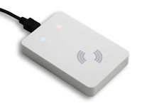

.. currentmodule:: metratec_rfid

.. _deskiduhf:

DeskID UHF Desktop Reader
=========================

The DeskID UHF is a small and economical RFID reader and writer for the use with 868 MHz (UHF RFID, EU frequency). It allows 
reading and writing EPC Class 1 Gen 2 tags directly with your PC or notebook computer. This makes it an indispensable tool in UHF 
applications in which tags have to be tested, written to or initialized easily.
The low profile design housing looks great on any desktop and is connected to the PC via USB. As it is also USB powered, setup is 
especially easy. Reading range depends on tag type and is typically in the range of 10 to 30 cm. Reading several tags at once (anti 
collision mode) is also possible.

.. autoclass:: metratec_rfid.DeskIdUhf
    :members:
    :inherited-members:
    :exclude-members: get_input, get_inputs, get_output, get_outputs,
      get_antenna, set_antenna, get_antenna_multiplex, set_antenna_multiplex,
      set_antenna_outputs, set_cb_input_changed, enable_antenna_report,
      get_inventory_multi, start_inventory_multi, stop_inventory_multi
    :special-members: __init__
