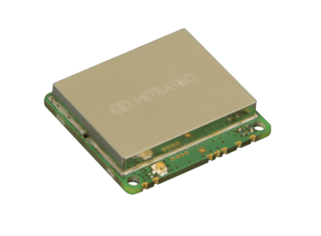

.. currentmodule:: metratec_rfid

.. _dwarfg2v2:

DwarfG2 v2 UHF RFID OEM Module
==============================

Based on the Impinj E310 frontend IC, this module delivers great performance
in a small package and without measurable heat development.
Bringing UHF RFID functionality into your embedded device has never been easier. 

Supports all the latest EPC Gen2 v2 features as well as propriety Impinj
tag features like FastID and TagFocus. Thanks to the wide operating frequency
range, the same module can be used worldwide.

Standard version
----------------

Read modern UHF transponders with up to 21 dBm and 1.5 m range.

.. autoclass:: metratec_rfid.DwarfG2v2
    :members:
    :inherited-members:
    :exclude-members:  check_antennas, enable_input_events, get_antenna, get_antenna_multiplex, get_input, get_inputs, get_inventory_multi, get_output, get_outputs, set_antenna, set_antenna_multiplex, set_cb_input_changed, set_output, set_outputs, start_inventory_multi, stop_inventory_multi
    :special-members: __init__

.. _dwarfg2miniv2:

Mini version
------------

Read modern UHF transponders with up to 9 dBm and 50 cm range.

.. autoclass:: metratec_rfid.DwarfG2Miniv2
    :members:
    :special-members: __init__
    :exclude-members:  check_antennas, enable_input_events, get_antenna, get_antenna_multiplex, get_input, get_inputs, get_inventory_multi, get_output, get_outputs, set_antenna, set_antenna_multiplex, set_cb_input_changed, set_output, set_outputs, start_inventory_multi, stop_inventory_multi

.. _dwarfg2xrv2:

XR version
----------

Read modern UHF transponders with up to 27 dBm and 5 m range.

.. autoclass:: metratec_rfid.DwarfG2XRv2
    :members:
    :special-members: __init__
    :exclude-members:  check_antennas, enable_input_events, get_antenna, get_antenna_multiplex, get_input, get_inputs, get_inventory_multi, get_output, get_outputs, set_antenna, set_antenna_multiplex, set_cb_input_changed, set_output, set_outputs, start_inventory_multi, stop_inventory_multi
