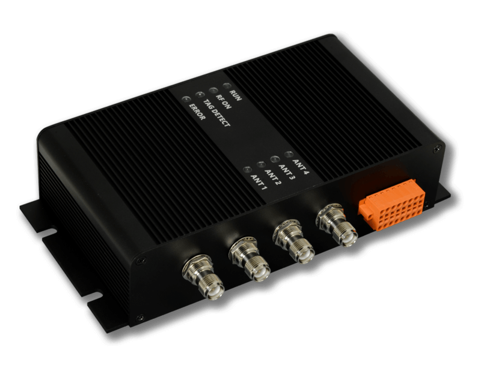

.. currentmodule:: metratec_rfid

.. _pulsarlr:

PulsarLR UHF RFID Reader
========================

  
The right tool for the hardest UHF RFID applications. This reader can reach a reading distance of up to 12m with a modern UHF RFID
transponder and easily scan a few hundred tags per second.
The four antenna ports give you the flexibility to build complex RFID devices, such as RFID gates and tunnels.

.. autoclass:: metratec_rfid.PulsarLR
    :members:
    :inherited-members:
    :special-members: __init__
