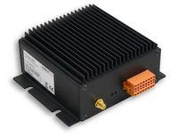

.. currentmodule:: metratec_rfid

.. _pulsarmx:

PulsarMX UHF RFID Reader
========================

The PulsarMX is a UHF RFID Reader for applications with medium read range between 2 and 5 m and up to 100 tags at the same 
time in the field (anti collision). Typical applications include container tracking, reading data from sensor tags or as a scanning station 
on a conveyor belt. With its low cost, it open up new possibilities for RFID which were not economical before.

.. autoclass:: metratec_rfid.PulsarMX
    :members:
    :inherited-members:
    :special-members: __init__
