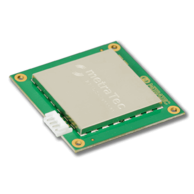

.. currentmodule:: metratec_rfid

.. _qrg2:

QRG2 UHF RFID Embedded Module
=============================

The DeskID UHF v2 is a compact RFID reader/writer working at 868 MHz (ETSI/EU version) or 902 – 928 MHz (FCC/USA version).
Its main use is to read and write data to EPC Gen 2 transponders directly from your PC or laptop. Thus, the device is a handy tool
for all UHF applications for testing tags, writing an EPC, or just debugging your UHF gate.

The slim, well-designed housing fits on every desktop and is connected to the PC using a normal USB-C cable which is also used to power
the device (no separate power supply necessary). Thanks to the new E310 Reader IC from Impinj used in the device, the read range is
between 10 and 80 cm, depending on the type of transponder used. You can also read up to 50 transponders simultaneously with the
integrated anti-collision mode.

ETSI version
------------

This class only works with the ETSI version of the device.

Use `metratec_rfid.QRG2FCC` for the FCC model.

.. autoclass:: metratec_rfid.QRG2
    :members:
    :inherited-members:
    :exclude-members:  check_antennas, enable_input_events, get_antenna, get_antenna_multiplex, get_input, get_inputs, get_inventory_multi, get_output, get_outputs, set_antenna, set_antenna_multiplex, set_cb_input_changed, set_output, set_outputs, start_inventory_multi, stop_inventory_multi
    :special-members: __init__

.. _qrg2fcc:

FCC version
-----------

This class has to be used with the FCC version of the device.
It contains the same methods as the ETSI version except for the
listed changes (if any).

.. autoclass:: metratec_rfid.QRG2FCC
    :members: __init__
    :special-members: __init__
    :exclude-members:  check_antennas, enable_input_events, get_antenna, get_antenna_multiplex, get_input, get_inputs, get_inventory_multi, get_output, get_outputs, set_antenna, set_antenna_multiplex, set_cb_input_changed, set_output, set_outputs, start_inventory_multi, stop_inventory_multi
